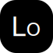

<p align="center"></p>

[](https://www.npmjs.com/package/@litert/loader "Stable Version")
[](https://www.npmjs.com/package/@litert/loader "Development Version")
[](https://github.com/litert/loader.js/blob/master/LICENSE)
[](https://nodejs.org/dist/latest-v12.x/)
[](https://github.com/litert/loader.js/issues)
[](https://github.com/litert/loader.js/releases "Stable Release")
[](https://github.com/litert/loader.js/releases "Pre-Release")

輕量易用的運行于瀏覽器的模組載入器。

## 語言

[English](../README.md) | [简体中文](README.sc.md)

## 特性

- [x] 支援直接運行記憶體檔案代碼。  
- [x] 庫輕量，配置簡單。  
- [x] 無侵入，不會對您的 script 引入的其他庫造成任何影響。  
- [x] 支援 CommonJS、ES6 Module 格式。  
- [x] 自動支援 fetch 函數，無需額外載入。  
- [x] 支援 TypeScript。

## 安裝

這是運行于瀏覽器的庫，因此只需要使用 script 標籤引用即可。

### NPM

可以直接使用 npm 下載庫到本地：

```sh
$ npm i @litert/loader --save
```

可以安裝最新的開發版到本地：

```sh
$ npm i @litert/loader@dev --save
```

### CDN（推薦）

推薦引用位址：https://cdn.jsdelivr.net/npm/@litert/loader@3.4.8/dist/index.min.js，也可以此處查找：https://cdn.jsdelivr.net/npm/@litert/loader/。

同樣可使用 [unpkg](https://unpkg.com/@litert/loader@3.4.8/dist/index.min.js)。

## Usage

通常的使用方式：

```html
<script src="https://cdn.jsdelivr.net/npm/@litert/loader@3.4.8/dist/index.min.js"></script>
```

代碼提示需要在「tsconfig.json」中添加：

```json
{
    "compilerOptions": {
        ...
        "typeRoots": [
            "./node_modules/@types",
            "./node_modules/@litert/loader"
        ]
    }
}
```

所有操作請寫在回呼函數當中。

```typescript
loader.ready(function() {
    let files: Record<string, Blob | string> = { ... };
    let tmodule: any, module2: any;
    [tmodule, module2] = loader.require(['../dist/tmodule', './module2'], files);
});
```

或者使用 ?path= 直接載入入口 js 檔，js 後綴可省略。

```html
<script src="https://cdn.jsdelivr.net/npm/@litert/loader@3.4.8/dist/index.min.js?path=../lib/test"></script>
```

使用 ?cdn= 參數設置三方庫載入的源地址，預設為：https://cdn.jsdelivr.net。

```html
<script src="https://cdn.jsdelivr.net/npm/@litert/loader@3.4.8/dist/index.min.js?cdn=https://cdn.xxx.xxx"></script>
```

使用 ?map= 參數設置第三方庫的路徑，JSON 字串，僅在含有 path 參數下有效。

```html
<script src="https://cdn.jsdelivr.net/npm/@litert/loader@3.4.8/dist/index.min.js?&path=xxx&map={'xxx':'https://xx/npm/index'}"></script> 
```

使用 ?npm= 參數 loader 將自動去 npm 查找相關的庫進行嗅探載入，JSON 字串，模組名跟版本號，僅在含有 path 參數下有效。

```html
<script src="https://cdn.jsdelivr.net/npm/@litert/loader@3.4.8/dist/index.min.js?&path=xxx&npm={'xxx':'1.0.0'}"></script>
```

你可以使用 fetchFiles 方法載入網路檔到記憶體。

```typescript
let files: Record<string, Blob | string> = await loader.fetchFiles([
    '../dist/tmodule.js',
    './module2.js',
    'https://cdn.jsdelivr.net/npm/seedrandom@3.0.5/seedrandom.min.js'
]);
```

使用 sniffFiles 載入網路檔案到記憶體，會嗅探檔中的包含關係，例如 js 的 import、require 等，CSS 的 url 等。

```typescript
let files: Record<string, Blob | string> = {};
await loader.sniffFiles([
    'https://cdn.jsdelivr.net/npm/@juggle/resize-observer@3.2.0/lib/exports/resize-observer.js'
], {
    'files': files
});
```

使用 map 選項，可以指定庫的別名，import 命令的別名也以此為依據。

```typescript
let cache: Record<string, any> = {};
let files: Record<string, Blob | string> = {};
if (!Object.keys(files).includes('https://cdn.jsdelivr.net/npm/seedrandom@3.0.5/seedrandom.min.js')) {
    await loader.fetchFiles([
        'https://cdn.jsdelivr.net/npm/seedrandom@3.0.5/seedrandom.min.js'
    ], {
        'files': files
    });
}
let sr = loader.require('seedrandom', files, {
    'cache': cache,
    'map': {
        'seedrandom': 'https://cdn.jsdelivr.net/npm/seedrandom@3.0.5/seedrandom.min',
        '~/': './'
    }
})[0];
```

## 測試

### Node

編譯 TS 代碼之後，可以直接執行 node dist/test-on-node 來觀察在 node 環境中預設的運行結果。

### 瀏覽器

使用瀏覽器訪問「test/」來查看比對結果與 node 環境中相同。

[你也可以直接點這裡線上查看瀏覽器示例。](https://litert.github.io/loader.js/test/)

## 許可

這個庫的許可為 [Apache-2.0](./LICENSE)。